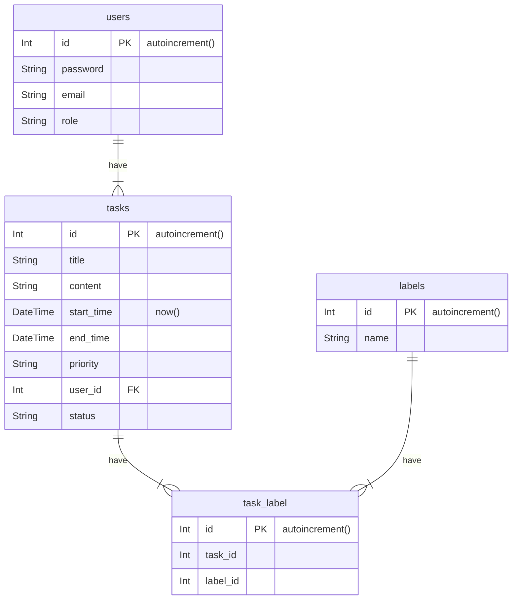

# todotask
### table schema

### 任務功能
 - [x] 可新增自己的任務。
 - [ ] 使用者登入後，只能看見自己建立的任務。
 - [ ] 可設定任務的開始及結束時間。
 - [ ] 可設定任務的優先順序（高、中、低）。
 - [ ] 可設定任務目前的狀態（待處理、進行中、已完成）。
 - [ ] 可依狀態篩選任務。
 - [ ] 可以任務的標題、內容進行搜尋。
 - [ ] 可為任務加上分類標籤。
 - [ ] 任務列表，並可依優先順序、開始時**間及結束時間等進行排序。
**滿足以上需求之後，還會需要如下的管理機制：
 - [ ] 使用者的管理功能

### 瀏覽器支援

預設需要支援各種瀏覽器較新的版本。

### 開發工具

#### 請以下列程式語言、網站開發框架及資料庫系統進行開發：
  Ruby 3.2.2
  Ruby on Rails 7
  PostgreSQL 14.9
#### 伺服器建議使用以下平台（不限定）：
 - [ ] Heroku
 - [ ] Fly.io
 - [ ] AWS
 - [ ] GCP

